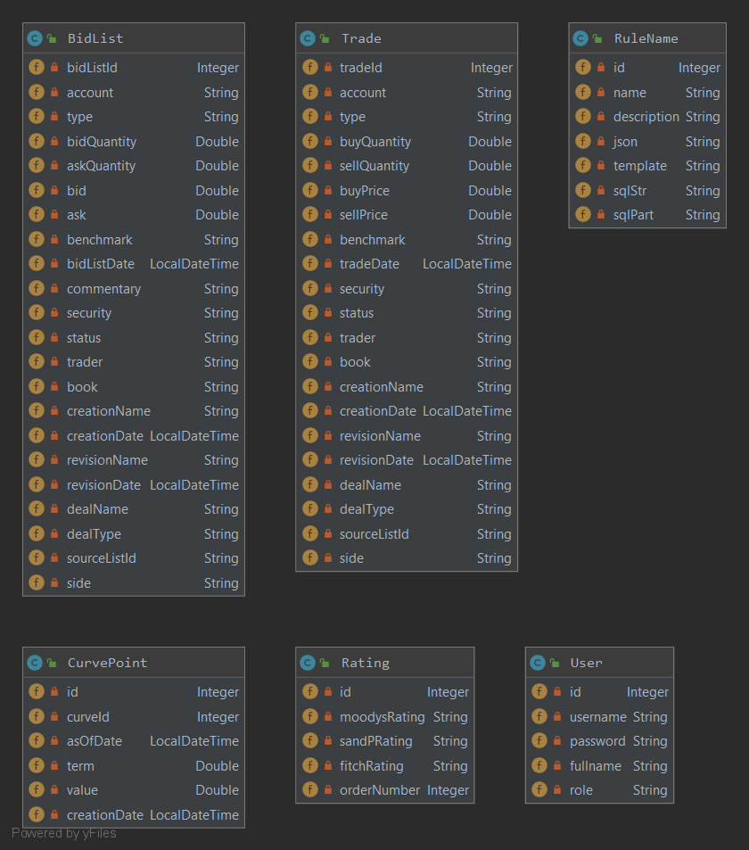

# Poseidon App

Poseidon is a financial and trading web-app that gives several features to a connected user : 
- Create, edit or delete :
    - Bidlists
    - Curvepoints
    - Rules
    - Ratings
    - Trades
    
- At this time, anybody who get the user/add url can add some users and grant them with rights
All features and added elements are accessible for every connected user. That's a pool.
Web-app is in dark mode

## Database Schema (UML)



## Prerequisite to run it

- Java 1.8 JDK (or +)
- Maven 3.5.X (or +)
- MySQL 5.X (or+) : You need to create a MySQL database named "demo" on localhost:8080

## Run app

```mvn
mvn clean install
mvn clean verify (generate tests and test report)
mvn site (generate reportings)
```

```MyQL
Hibernate no used : Please run file on your created db or : data.sql (src/java/resources)
local (Hibernate used) : start Spring boot context and let hibernate create schema (may have to change spring.jpa.hibernate.ddl-auto in properties file)
```

(if you want to develop on local)
```Spring Boot
mvn spring-boot:run (run app)
mvn spring-boot:stop (stop app)
```

## Documentation
Read JavaDoc to know endpoints features or navigate into web-app once your logged in. 

## Contributing
Github repo is public, you can fork it and make improvements.
Please make sure to update tests as appropriate.

https://github.com/luckavn/sa.projet7/tree/develop
